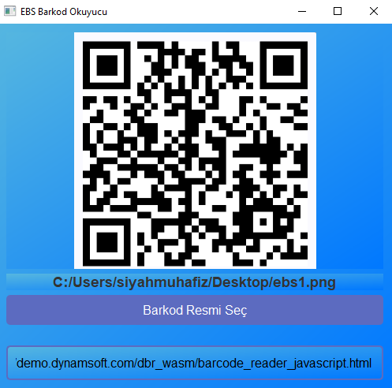
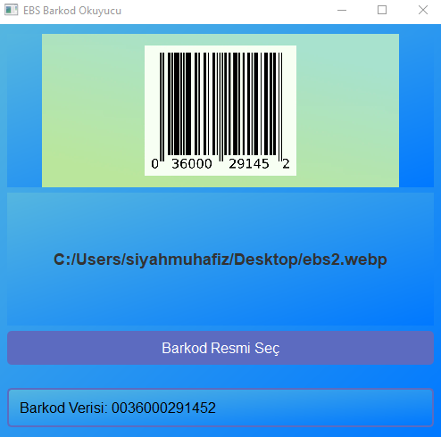

# EBS Barkod Okuyucu

EBS Barkod Okuyucu, QR kodları ve barkodları kolayca okuyabilen bir masaüstü uygulamasıdır. PyQt5 ile geliştirilmiş bu uygulama, kullanıcıların barkod resimlerini seçmesine veya dosya yolunu girerek barkod verilerini elde etmelerine olanak tanır.

## Özellikler

- Barkod ve QR kodları okuma.
- Resim dosyası seçme veya URL/dosya yolu ile barkod okuma.
- Barkod verisinin ekran üzerinde gösterilmesi.

## Uygulama arayüzü:





## Gereksinimler

Bu uygulamayı çalıştırmak için aşağıdaki kütüphanelere ihtiyaç vardır:

- Python 3.x
- PyQt5
- pyzbar
- Pillow (PIL)

### Gerekli kütüphaneleri yüklemek için:

```bash
pip install pyqt5 pyzbar pillow
```

## Kullanım

1. Uygulamayı başlatın.
2. "Barkod Resmi Seç" butonuna tıklayarak bir resim dosyası seçin veya bir dosya yolu girin.
3. Uygulama, seçilen resmin barkodlarını otomatik olarak okuyacak ve verilerini gösterecektir.

## Lisans

Bu proje [Apache License 2.0](http://www.apache.org/licenses/LICENSE-2.0) lisansı altında lisanslanmıştır.


---

